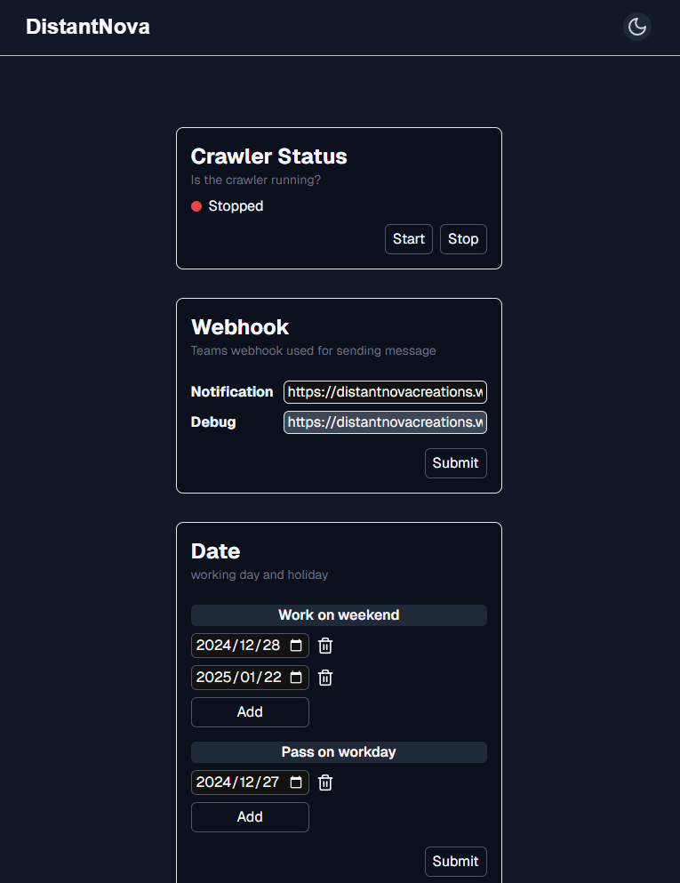
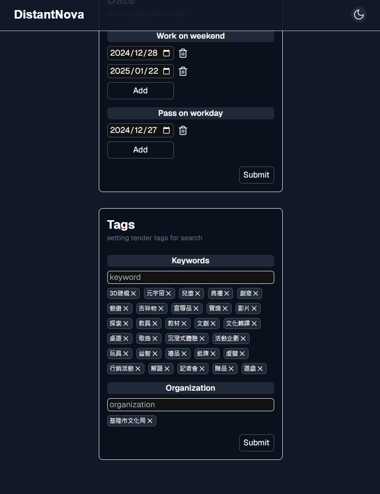

# Tender List

## Description

這個專案來自於好友的需求，可以定時檢查最新的[政府標案](https://web.pcc.gov.tw/prkms/tender/common/basic/indexTenderBasic)並發送通知至 Teams 頻道。

專案核心是 APScheduler 的進階運用，雖然技術層面並不複雜，但藉此機會重新架構了[舊的專案](https://github.com/AilentDE/Moaideas/tree/master/tender_project)的結構。

資料庫採用 SQLite3，不需要額外啟動資料庫伺服器。

並且以 Next.js 開發了前端介面（雖然以這專案而言有點過重了）讓使用者能夠靈活調整設定，並透過 Server Action 實現端點保護機制。

有興趣歡迎參考使用，也可以依需求自行加入 Proxy 來提升爬蟲作業的穩定性。

## Screenshots





## Usage

1.  準備 `.env` 檔案

    ```bash
    # 標案網址
    TARGET_URL=
    # Teams 通知用的Webhook url
    WEBHOOK_TOKEN=
    WEBHOOK_DEBUG_TOKEN=
    # 初始化的標案關鍵字及單位名稱，可以留空
    INIT_TAGS=
    INIT_ORG_TAGS=
    # SQLite檔案路徑
    DB_PATH=
    ```

2.  啟動服務

    ```bash
    python -m venv venv
    venv/Scripts/activate
    # or source venv/bin/activate
    pip install -r requirements.txt
    fastapi dev
    ```

3.  部屬容器，我準備了兩種 docker-compose 文件依照實際需求自行使用
    (我是以 windows 開發並部署到 ubuntu server)

    1. Windows Docker Desktop

       ```bash
       docker-compose up -d
       ```

    2. Linux

       ```bash
       docker-compose -f docker-compose-linux.yml up -d
       ```
